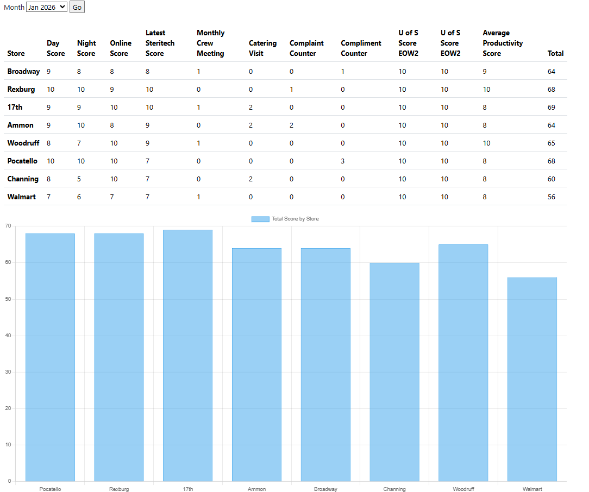

## Top Bun

Top Bun is a Flask web application for tracking store performance through structured assessments (day, night, and online forms) and visualizing rankings on a dashboard.

### Features
- **Store management**: Create and manage store locations, with soft-delete support to preserve history.
- **Assessments and questions**: Configure assessments made up of questions with different scoring/aggregation types.
- **Responses and scoring**: Capture responses, automatically calculate percent scores, and rank stores.
- **Dashboard**: View monthly performance, rankings by form type, and aggregated scores per store.

### Tech stack
- **Backend**: Python, Flask
- **Database**: SQLite with SQLAlchemy ORM
- **Forms**: Flask-WTF / WTForms

